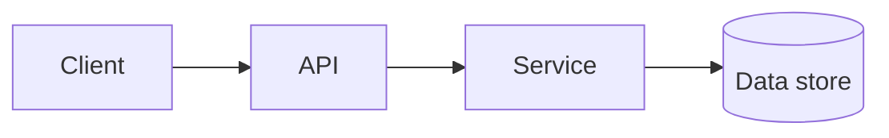

# Document templates

Use these as **outlines**. Rename sections for the domain (SaaS, internal tool, data platform, mobile, etc.).

---

## 1. Project Requirements Document (PRD)

```markdown
# Project Requirements: <Project Name>

**Version:** 0.1 | **Date:** <date> | **Owner:** <role or TBD>

## Executive summary
- Problem in one paragraph
- Proposed outcome
- Key constraints

## Problem statement
- Current pain / opportunity
- Who is affected

## Goals and non-goals
### Goals
- PRD-O1: ...
- PRD-O2: ...

### Non-goals (out of scope)
- ...

## Personas / stakeholders
| Persona | Needs | Success criteria |
|---------|--------|-------------------|
| ... | ... | ... |

## User journeys (high level)
1. ...
2. ...

## Functional requirements
| ID | Requirement | Priority (MoSCoW) | Notes |
|----|-------------|-------------------|-------|
| FR-01 | ... | Must | Maps to PRD-O1 |

## Success metrics
| Metric | Target | Measurement |
|--------|--------|-------------|
| ... | ... | ... |

## Assumptions and dependencies
- Assumptions: ...
- Dependencies on other teams/systems: ...

## Risks
| Risk | Impact | Mitigation |
|------|--------|------------|
| ... | H/M/L | ... |

## Open questions
- ...
```

---

## 2. Technical Requirements Document (TRD)

```markdown
# Technical Requirements: <Project Name>

**Version:** 0.1 | **Date:** <date>

## Context
- Summary of PRD scope this TRD covers
- Reference PRD objectives: PRD-O1 …

## System context
- Context diagram (describe if not drawing): actors, external systems

## Architecture constraints
- Hosting / cloud / on-prem
- Languages, frameworks (if mandated)
- Integration points

## Functional technical requirements
| ID | Requirement | Source (PRD) | Verification |
|----|-------------|--------------|------------|
| TR-01 | ... | FR-01 / PRD-O1 | Test / check |

## Non-functional requirements (NFRs)
### Performance
- Latency, throughput, scale (as applicable)

### Security & privacy
- AuthN/AuthZ, data classification, PII handling

### Reliability & availability
- SLOs, backup, disaster recovery (as applicable)

### Observability
- Logging, metrics, tracing expectations

### Compliance
- Standards (GDPR, SOC2, etc.) if relevant

## Data
- Entities, storage, retention, migration

## APIs and interfaces
- External APIs consumed / provided
- Protocols, versioning, error model

## Environments
- dev / staging / prod expectations

## Technical risks and mitigations
| Risk | Mitigation |
|------|------------|
| ... | ... |

## Open technical questions
- ...
```

---

## 3. Design Document

```markdown
# Design: <Project Name>

**Version:** 0.1 | **Date:** <date>

## Purpose
- What this design covers (component, service, or full system)
- TRD references: TR-01 …

## Goals and principles
- Simplicity, security-by-default, operability, etc.

## Architecture overview
- Major components and responsibilities
- Diagram description (or mermaid if helpful)



## Component design
### <Component A>
- Responsibility
- Key interfaces
- TRD mapping: TR-xx

### <Component B>
- ...

## Data design
- Model overview
- Consistency, transactions, idempotency (if relevant)

## Key flows
### Flow: <name>
1. ...
2. ...

## Failure modes and handling
- Retries, fallbacks, user-visible errors

## Security model
- Threat notes aligned with TRD

## Testing strategy (design-level)
- Unit / integration / e2e focus areas

## Rollout and migration
- Feature flags, phased rollout, data backfill

## Open design questions
- ...
```

---

## 4. Timeline

```markdown
# Timeline: <Project Name>

**Planning horizon:** <e.g., 12 weeks> | **Start:** <TBD / date>

## Milestones
| Milestone | Target date | Outcome |
|-----------|-------------|---------|
| M1 — Discovery complete | Week 1 | PRD/TRD v0 signed off |
| M2 — Design complete | Week 2 | Design doc approved |
| M3 — MVP scope | Week … | Feature set X in prod/staging |

## Phased plan
| Phase | Duration | Focus | Dependencies |
|-------|----------|-------|--------------|
| Phase 0 — Foundations | ... | ... | ... |
| Phase 1 — MVP | ... | ... | ... |
| Phase 2 — Hardening | ... | ... | ... |

## Critical path
- Ordered list of blocking items

## Parallel tracks
- What can run concurrently

## Buffers and review gates
- Where to pause for review / UAT
```

---

## 5. Features list

```markdown
# Features: <Project Name>

**Prioritization:** MoSCoW or P1–P4 — pick one and stay consistent.

## Epic / theme grouping (optional)
### Epic: <name>
| ID | Feature | Description | Priority | PRD | TRD | Phase |
|----|---------|-------------|----------|-----|-----|-------|
| F-01 | ... | ... | Must | PRD-O1 | TR-01 | Phase 1 |
| F-02 | ... | ... | Should | PRD-O2 | TR-03 | Phase 1 |

## Acceptance criteria pattern
For each feature, prefer:
- **Given / When / Then** or bullet criteria testable by QA

## Traceability matrix (summary)
| PRD objective | TRD IDs | Features |
|---------------|---------|----------|
| PRD-O1 | TR-01, TR-02 | F-01, F-04 |

## Deferred / future
| ID | Feature | Reason |
|----|---------|--------|
| ... | ... | ... |
```

---

## Combined delivery note

When generating all five in one response:

1. Keep **IDs stable** across sections (copy/paste friendly).
2. Put **Assumptions** once in PRD (and reference from TRD if unchanged).
3. End with a **short traceability summary** (table or bullet list).
